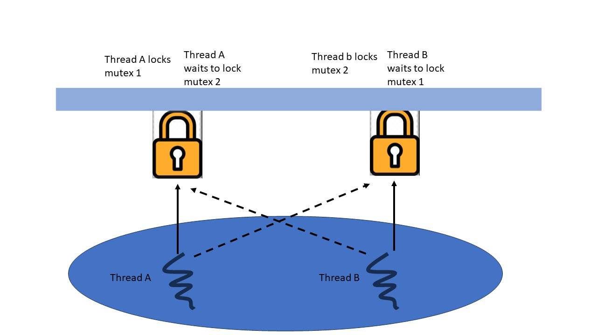

# Dead Lock
* A thread is deadlocked when it cannot run
* Often used to refer to "mutual deadlock"
    * Two or more threads are waiting for eachother
    * Thread A waits for thread B to do something
    * Thread B is waiting for A to do something
    * Thread A and B are waiting for an event that can never happens
* The classic example involves waiting for mutexs
  

## Mutual Deadlock
* Can also occurs when waiting for
    * The result of a computation performed by another thread
    * A message sent by another thread
    * A GUI evevnt produced by another thread
* The second most common problem in muti threading code
* Often caused by threads trying yo lock mutexs in different orders

## Deadlock Avoidance
* A simple way to avoid deadlock
    * Both threads try to acquire the locks in the same order
        - Thread A and B both try to lock the mutex1 first
        - The successful thread then tries to lock mutex 2
## Deadlock Avoidance
* This is not ideal
    * Relies on programmer
    * May not be feasible in large programs