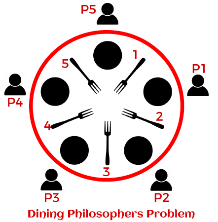

# Dead Lock Example
## Dinning Philosophers Problem

[ImageTakenFrom](https://www.javatpoint.com/dining-philosophers-problem-and-solution-in-java)

### Rules 
* A philosopher has two states: thinking and eating
* Each fork can only be held by one philosopher at a time
    * A philosopher can only pick up one fork at a time
    * A philosopher must pick up both forks before they can eat
    * When philosopher finishes eating, they put down both forks immediately
    * A philosopher may pick up a fork as soon as it is put down by another
* A philosopher has no awareness of other philosopher's actions.
* If a philosopher does not eat at all, they will die of starvation.

### Intended scenario
* Philosopher thinks
* Philosopher picks up left fork
* Philosopher thinks
* Philosopher picks up right fork
* Philosopher eats
* Philosopher puts down both forks
* Philosopher thinks

### Implementation
* A separate thread for each Philosopher
* Each fork has an associated mutex

```ruby
//A mutex prevents more than one Philosopher picking up the same fork
std::mutex fork_mutex[nforks];

//A Philosopher thread can only pick up a fork if it can lock the corresponding mutex
//Try to pick up the lefy fork
fork_mutuex[lfork].lock();
//Try to pick up thr right fork
fork_mutuex[rfork].lock();
//Succeeded this Philosopher can now eat
```
### Deadlock
* All the philosopher pick up their left fork
* None of the tight forks are available
    * B picks up 2
    * Fork 2 is A's right fork
    * A cannot eat without picking up fork 2
    * Fork 2 will not become available until B has finished eating
    * B cannot start eating because C has taken fork 3
* The philosopher threads are deadlocked
    * The philosophers cannot enter "eating" state.
    