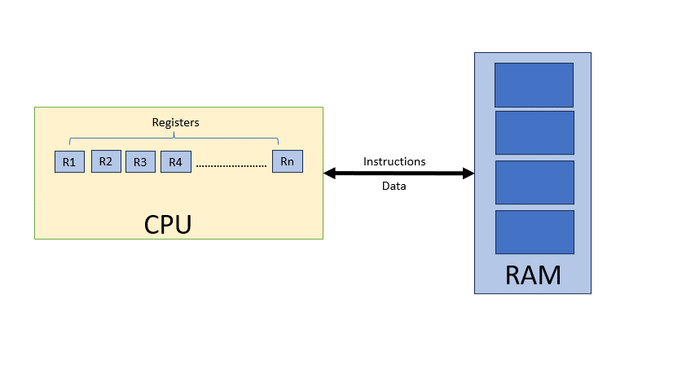

# MultiThreading
One of the most potent and essential features of almost every computer processor on the market today is multithreading. Software can run multiple threads of code concurrently within the same application. Multithreading is essential to the smooth operation of nearly all production-grade software, including web servers, web browsers, databases, and mobile applications.

Multithreading is frequently perceived as being challenging. It's probably defensible when compared to other software development principles. But there aren't many differences between normal programming and multithreading. Simply said, there could be more danger. However, by learning to avoid the risk, you may create considerably more potent algorithms and programs than you could with a single threaded approach.

In order to understand multithreading, we must understand how computer works.

## How old computer works?

     