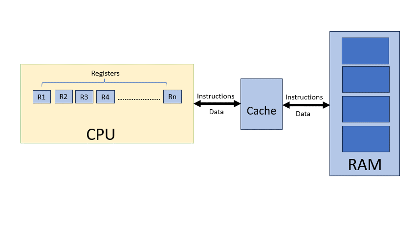
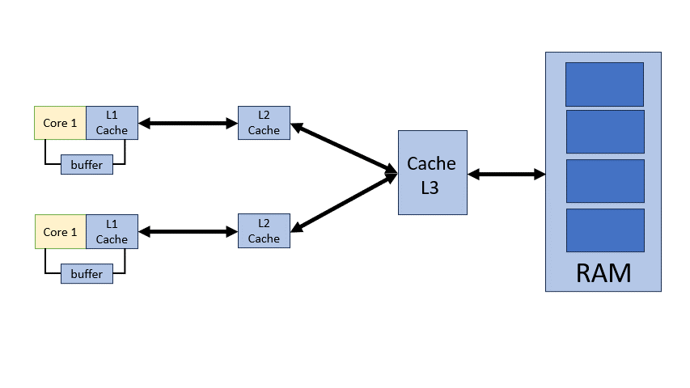
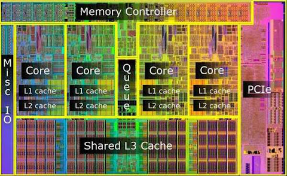

# MultiThreading
One of the most potent and essential features of almost every computer processor on the market today is multithreading. Software can run multiple threads of code concurrently within the same application. Multithreading is essential to the smooth operation of nearly all production-grade software, including web servers, web browsers, databases, and mobile applications.

Multithreading is frequently perceived as being challenging. It's probably defensible when compared to other software development principles. But there aren't many differences between normal programming and multithreading. Simply said, there could be more danger. However, by learning to avoid the risk, you may create considerably more potent algorithms and programs than you could with a single threaded approach.

In order to understand multithreading, we must understand how computer works.

## How old computer works?

     

The process by which the CPU (Central Processing Unit) fetches data and instructions from memory is fundamental to the operation of any computer. This process typically involves several steps:

1. Fetch: The CPU first fetches the next instruction to be executed from memory. It does this by sending a request to the memory subsystem, specifying the address of the instruction it needs.
2. Decode: Once the instruction is fetched, the CPU decodes it to determine what operation needs to be performed and what operands are involved.
3. Execute: After decoding the instruction, the CPU executes the operation specified by the instruction. This may involve performing arithmetic or logical operations, transferring data between registers or memory locations, or branching to a different part of the program.
4. Memory Access (if needed): Some instructions may require accessing data from memory. In this case, the CPU sends a memory access request to retrieve the necessary data from the specified memory address.
5. Write Back (if needed): After executing the instruction, the CPU may need to write the results back to memory or update internal registers.

Spending significant time transferring data between the CPU (Central Processing Unit) and RAM (Random Access Memory) can lead to several disadvantages, including:

1. Slow Performance: If the CPU has to wait for data to be transferred to or from RAM, it can slow down the overall performance of the system. This is especially noticeable in tasks that require frequent access to large amounts of data, such as video editing or gaming.
2. Increased Latency: Accessing data from RAM typically involves a certain amount of latency, as the CPU has to wait for the data to be retrieved from memory. This latency can add up, particularly in systems with slower RAM or when accessing data stored in distant memory locations.
3. Bottlenecking: The speed at which the CPU can process data may exceed the speed at which data can be transferred to and from RAM. This creates a bottleneck, limiting the overall performance of the system and preventing the CPU from reaching its full potential.
4. Power Consumption: Constantly transferring data between the CPU and RAM consumes energy, contributing to overall power consumption. In battery-powered devices like laptops or mobile devices, this can reduce battery life and lead to shorter usage times between charges.

## Process VS Thread
Processes and threads are fundamental concepts in operating systems and concurrent programming. Here are the main differences between them:

|                             | Process       | Thread |
|-----------------------------| ------------- | ------------- |
| Defination                  | A process is an independent unit of execution in a computer program that consists of its own memory space, resources, and a single thread of execution. Each process has its own address space, containing code, data, and system resources.|A thread is a subset of a process, representing an independent flow of execution within that process. Threads share the same memory space and resources as their parent process.               |
| Resource Allocation         |Each process has its own allocated system resources, including memory, file descriptors, and CPU time. Processes are typically isolated from each other and communicate through inter-process communication mechanisms.               |Threads within the same process share the same memory space and resources. They can communicate directly with each other through shared memory, making inter-thread communication more efficient than inter-process communication.               |
| Creation Overhead           | Creating a new process is relatively expensive in terms of system resources and time. This is because each process requires its own address space and resources, which must be allocated and initialized.|Creating a new thread within an existing process is generally faster and less resource-intensive than creating a new process. Since threads share the same address space and resources, thread creation typically involves less overhead.               |
| Concurrency and Parallelism |Processes provide a higher level of isolation and independence, making them suitable for achieving concurrency and parallelism in a program. Multiple processes can run concurrently on a multi-core CPU, leveraging parallelism to improve performance.               |Threads within the same process share resources and can execute concurrently. Threads are often used to perform tasks in parallel within a single program, utilizing multiple CPU cores efficiently.               |
| Fault Isolation             |Processes are isolated from each other, meaning that a failure in one process typically does not affect other processes. This isolation provides better fault tolerance and system stability.|Since threads share the same memory space and resources, a failure in one thread can potentially affect other threads within the same process. Care must be taken to ensure proper synchronization and error handling to prevent issues like race conditions and deadlock.|

In conclusion, while both processes and threads are computer program execution units, they differ in terms of resource allocation, creation overhead, concurrency paradigm, and fault separation capabilities. While threads offer lower overhead and more efficient communication, they also come with a larger overhead cost. As a result, threads must be carefully synchronized to prevent concurrency problems.

## Concurrency:
One of the important concept in multithreading is concurrency. Concurrency is generally meant to mean multiple threads running at the same time. As we have seen that computer can run many task at same time like playing videos, using google browser, reading mail box, reading key strokes, moving mouse pointers etc.

### Types of Concurrency:
1. Hardware Concurrency: Modern computers have multiple processors. These processors are in the form on multiple CPU chips or single CPU chip contains multiple cores. Different processors can perform different activities at the same time, even within the same program. These are known as hardware Threads. Each processor follows its own "thread of execution" through the code.
- 1 hardware thread <=> 1 processor core.
2. Software Concurrency: Modern operating systems support Software Concurrency. In software concurrency, a single program can perform multiple activies at the same time. These activities are managed by operating system. Typically there are more software threads then hardware threads. Some threads may have to stop and wait for something, while they are waiting, another thread which is ready can run.

### Multi-threaded program on computer with single Processor
This is implemented by time-slicing.
Each thread runs on the CPU for a short time e.g
- Thread A starts, runs for short period, then pause
- Thread B starts, runs for short period, then pause
- Thread C starts, runs for short period, then pause
- Thread B runs again from where it left off, then pause
- Thread C runs again from where it left off, then pause
This is done very quickly. The threads apperas to run concurrently. These threads are controlled by schedular. This can be done in different ways.
- Pre-emptive scheduling: This is done by time slicing. A thread can run for a specific time. The schedular will interupt the thread when it has used its time slot and then another thread can run and used its time. Thread may start in any order and thread may be interupted at any time and it may be restarted at any time.
```
+---+  +------------+ +------------+ +------------+ +------------+ +------------+
| A |  |   ......   | |  RUNNING   | |   ......   | |  RUNNING   | |   ......   |
+---+  +------------+ +------------+ +------------+ +------------+ +------------+
+---+  +------------+ +------------+ +------------+ +------------+ +------------+
| B |  |  RUNNING   | |   ......   | |   ......   | |  ......    | |  RUNNING   |
+---+  +------------+ +------------+ +------------+ +------------+ +------------+
+---+  +------------+ +------------+ +------------+ +------------+ +------------+
| C |  |   ......   | |   ......   | |  RUNNING   | |  ......    | |   ......   |
+---+  +------------+ +------------+ +------------+ +------------+ +------------+
```
- Priority base Pre-emptive scheduling: This is similar to pre-emptive but in this case most highest priority threads can run first.
- Co-operative Scheduling: This is done by cooperation between threads. One threads tells other that i am finished and then next thread can run and share same data.

#### Disadvantages: 
* Requires a context switch
* Save the processor state for the current thread
    - Current values of processor registers
    - Program instruction pointer etc
* Load the saved processor state for the next thread
    - Values of processor registers when stopped etc
    - May also have to reload the threads instruction and data
* The processor cannot execute any instruction during context switch

## Computer with single Processor and Cache
* CPUs becom much faster at processing instructions.
* However, RAM access speed did not improve much.
* The CPU could not process instrcutions during data transfers . 
    - The CPU spent a lot of time eaiting for RAM to respond.
    - Memory latency become a problem.
* Computers started using small amount of cache memory.

 

### Cache Mmeory:
* Physically close to the CPU
* Stores copies of current and recently used data
* Reduces the time spent communicating with main memory.
* The CPU wants to fetch data
* Does the cache have a copy of the data?
    - Yes
        * There is a "cache hit"
        * The CPU use that copy
    - No
        * There is a "cache miss"
        * The data is fetched from main memory
* The CPU wants to store data
    - it writes tha data to cache
    - The data is written to main memory from cache and CPU continue with other work. This is managed by cache controller. The data is transfered in fixed size blocks known as cache lines typically 64 bytes on modern hardware(8 words). Each cache lines relates to an address in main memory.
### Static RAM
* This is faster than dynamic RAM usied in main memory.
* More expensive
* Use more power
* Ususally much smaller than main memory.

## Computer with  Multiple processors
* Multiple sockets
    - 2 or more processor chips in the computer.
* Multiple processor cores
    - Several processors within the same silicon chip.
* Hyperthreads
    - Duplicate some of the the circuitry within a processor core.
    - Enough to run a seperate thread, with its own execution stack.
### Multiple levels of Cache
* Level 1 cache
    - Private to each processor core.
    - As close to the core as possible.
* Level 2 cache
    - Usually private to each core
* Level 3 cache
    - Shared by all the cores on the same socket.

 

### Multiple Core Architecture 
* Intel core i5 die               
    

### Cache Controller
* Coordinates the Caches
    - The same data should have the same value in all caches.
    - The same data should have the same vale on all cores.
    - Cache coherency.
* Monitors caches for data changes.
    - A core modified data in its level 1 cache
    - The data is updated in the core's level 2 cache
    - The data is updated in the level 3 cache.
    - The data is updated in the other cores's caches.
### Typical Ccahe sizes and latency
* Intel "Coffee Lake" architecture (2018)
    - Level 1 cache 32kB data, 32KB instructions per core.
    - Level 2 cache 256kB data per core.
    - Level 3 cache 2-12MB data shared by all cores
* Latency measures the time taken to retrieve data
    - Level 1 cache 4 cycles
    - Level 2 cache 12 cycles
    - Level 3 cache 26-37 cycles
    - Main memory ~300 cycles
### Optimizations
* Pre-fetcher
    - Looks at incoming instructions.
    - Fetches data before it is needed
* Store buffer
    - This is between the core and the level 1 cache
    - Modified data is written to this buffer.
* The core can proceed to the next instruction
    - Does not need to wait for L1 cache
* These optimizations provide huge improvements
    - Avoid blocking the core when there is a cache miss.

### Synchronization Issues
* Different threads execute on different cores.
* They may share data.
* This can cause synchronization issues.
* Issue
    - Core 1's thread modified the shared data.
    - Core 1's writes new value to its store buffer
    - Core 2's thread wants to use the shared data.
    - Core 2 pre-fetches the shared data, or loads it from cache.
    - Core 2 gets the old value.
    - Core 2's thread does its computation using old value
    - Core 1's store buffer writes the new value to the cache.

## How to use this Repo?
* This repo is CMake Project.
* This repo consist of folders conainting different sections.
* Each folder consist of
    - build folder which is used for build files
    - cmake contains cmake functions for sanitizers and warnings.
    - src contains app and app contains main.cpp file
    - In some cases src also contains lib for library
    - CMakeLists.txt file main cmake file
    - Makefile Script to run for code execution and build

## Repo requirements:
* OS Linux 
* C/C++ tool chain GNU 
* CMake version 3.22
* Make